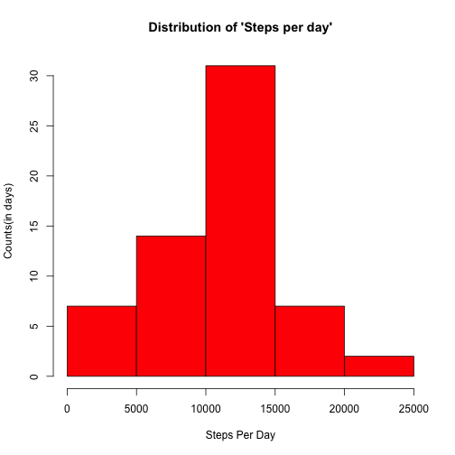

Peer Assessment 1
========================================================
<h1>Activity Monitoring through Step Counts </h1>
<p>This project takes the "Activity monitoring data[52k]" that was downloaded from the course website for the class, "Reproducible Research" taught by Johns Hopkins University, and analyzes its contents producing summaries and visuals.<a href="https://www.coursera.org/course/repdata">(see course webpage)</a></p> 
<p>From the course web site: "This assignment makes use of data from a personal activity monitoring device. This device collects data at 5 minute intervals through out the day. The data consists of two months of data from an anonymous individual collected during the months of October and November, 2012 and include the number of steps taken in 5 minute intervals each day."</p>
<p>The data consist of 17,568 observations of three variables: <b>steps</b>; the number of steps taken in a 5-minute interval, <b>date</b>; the date the measurement was taken in YYYY-MM-DD format, and, <b>interval</b>; an identifier for the 
5-minute interval in which the measurement was taken. Its format is a count that is incremented by 5 (0,5,10,15...) for 24 hours. There are 288 5-minute intervals in one day.</p> 

<h1>Loading and preprocessing the data</h1>
The following code loads the data and transforms the variables into
a manageable form using the 'as.factor()' and 'as.Date()' functions. The package "car" is downloaded and will be used later.

```r
library(car)

data <- read.csv("activity.csv", stringsAsFactors = FALSE)
data$interval <- as.factor(data$interval)
data$date <- as.Date(data$date)
```

<h1>What is the mean total number of steps taken per day?</h1>
  <h2>1. Histogram of the total number of steps taken each day.</h2>
The "tapply()" function is used to sum the number of steps per day. The results are placed in "dataVec" and are then plotted in a histogram showing the distribution of number of steps taken per day, and the counts of all the times those numbers occured. For example, the grouping of 0-500 steps per day was observed five times.

```r
dataVec <- tapply(data$steps, data$date, sum)

hist(dataVec, breaks = 5, col = "red", xlab = "Steps Per Day", ylab = "Counts(in days)", 
    main = "Distribution of 'Steps per day'")
```

 

  
 <h2>2. Calculate the mean & median for total number of steps per day.</h2>

```r
mean(dataVec, na.rm = TRUE)
```

```
## [1] 10766
```

```r
median(dataVec, na.rm = TRUE)
```

```
## [1] 10765
```

<h1>What is the average daily activity pattern?</h1>
 <h2>1. A time series plot of 5-min intervals (x-axis) and average number of steps taken(y-axis).</h2>
Below are two line plots of the average number of steps taken per interval. In the first plot, the interval is given in clock time and in the second plot, it's given by the number of intervals.

```r
interVec <- tapply(data$steps, data$interval, mean, na.rm = TRUE)
plot(interVec, type = "l", xlab = "5-min Interval(clock time)", ylab = "Avg # Steps", 
    main = "Avg Steps Per Interval", xaxt = "n")
axis(side = 1, at = c(0, 50, 100, 150, 200, 250, 300), labels = c("0", "4:05am", 
    "8:15am", "12:25pm", "4:35pm", "8:45pm", "12:55am"), tick = TRUE)
```

 


  <h2>2. Which 5 min. interval, on average across all days, contains the maximum number of steps?</h2>

```r
plot(interVec, type = "l", xlab = "5-min Intervals(100=100th interval)", ylab = "Avg # Steps", 
    main = "Avg Steps Per Interval", )
```

 

The peak comes near the 100th 5-minute interval which corresponds
to about 8:15am.

<h1>Imputing missing values</h1>
<h2>1. Calculate and report the total number of missing values.</h2>

```r
nrow(data[!complete.cases(data), ])
```

```
## [1] 2304
```

<h2>2 & 3. Devise a strategy for filling in the missing values in the dataset, and create a new dataset indentical to the first but with all the missing values filled in.</h2>
<h3>NOTES:</h3>
<ul>
<li>"dataVec" reveals the days that have missing values.</li> 
<li>Of interest are Nov. 9th, 10th and the 30th.</li>
<li>Days with missing values will be replaced with the                          
values of a nearby day; two days after for all days(to
account for consecutive days with NA's) except the 30th
which will utilize the previous day(it's the last observation).</li>
<li>'which()' returns a vector of indices of all the missing values. These account for 8 days(see 'dataVec' above).</li>
</ul>
The code below creates vector of indices of all the incomplete cases, then uses this to subset to a dataframe that only contains all the missing days. Finally, it extracts the index of the first instance of Nov. 30th and uses it as a condition in the if-else line within the for-loop that creates the new data set with no missing values.

```r
missingObs <- which(!complete.cases(data))
missObsFram <- data[missingObs, ]
Nov_30th <- which(missObsFram$date == "2012-11-30")

for (i in missingObs) {
    if (i >= Nov_30th[1]) {
        data$steps[i] <- data$steps[i - 288]
    } else {
        data$steps[i] <- data$steps[i + 576]
    }
}
```

<h2>4. Makes histogram of total number of steps taken each day and 
calculates the mean and median for the new data set.</h2>
The histogram for the new data set is almost identical to the histogram with the missing values, but has slight changes in the median and mean.

```r
dataVec <- tapply(data$steps, data$date, sum)
hist(dataVec, breaks = 5, col = "red", xlab = "Steps Per Day", ylab = "Counts(in days)", 
    main = "Distribution of 'Steps per day'")
```

 

<h2>2. Calculate the mean & median.</h2>

```r
mean(dataVec, na.rm = TRUE)
```

```
## [1] 10488
```

```r
median(dataVec, na.rm = TRUE)
```

```
## [1] 10600
```

<h1>Are there differences in activity patterns between weekdays and weekends?</h1>
<h2>1. Create a new factor variable in the dataset with two levels:“weekday” and “weekend” indicating whether a given date is a weekday or weekend.</h2>
The following code creates a one-variable dataframe("dayWkDat") to be binded to the main dataframe("data"). It uses "sapply()" to convert the days in the 'date' variable to their respective day of the week("Monday","Tuesday",etc.) placing it in a list('daysOfWeek'). Next, using "recode()" from the package "car", it takes 'daysOfWeek' and will recode those items to either 'weekend' or 'weekday' strings which will be used as two levels of a factor variable. Finally, 'daysOfWeek' is converted to a dataframe and binded to 'data'. 

```r
dayWkDat <- data.frame(DayClass = factor())
daysOfWeek <- sapply(data$date, weekdays)
daysOfWeek <- recode(daysOfWeek, " c('Monday','Tuesday','Wednesday','Thursday',\n                   'Friday')='weekday' ; else='weekend' ")
dayWkDat <- as.data.frame(daysOfWeek)
data <- cbind(data, dayWkDat)
```

<h2>2. Make a panel plot containing a time series plot(i.e. type = "l") of the 5-minute interval (x-axis) and the average number of steps taken, averaged across all weekday days or weekend days (y-axis).</h2>
The newest data set is subsetted on the two levels of its newly added  variable, "daysOfWeek": "weekend" or "weekday". The "tapply()" function is then used to find the mean of the number of steps taken per interval for both the 'weekend' level and the 'weekday' level. The results are then plotted.

```r
weekDays <- subset(data, daysOfWeek == "weekday")
weekEnds <- subset(data, daysOfWeek == "weekend")
weekDaysVec <- tapply(weekDays$steps, weekDays$interval, mean)
weekEndsVec <- tapply(weekEnds$steps, weekEnds$interval, mean)


par(mfcol = c(2, 1), mar = c(5.5, 5, 2, 1), cex = 0.6, cex.axis = 1.5, cex.lab = 2, 
    cex.main = 1.5, las = 0)
plot(weekEndsVec, type = "l", main = "weekend", col = "blue", xaxt = "n", xlab = "", 
    ylab = "Avg. Steps")
plot(weekDaysVec, type = "l", main = "weekday", col = "blue", xaxt = "n", xlab = "5-min. Interval", 
    ylab = "Avg. Steps")
axis(side = 1, at = c(0, 50, 100, 150, 200, 250, 300), labels = c("0", "4:05am", 
    "8:15am", "12:25pm", "4:35pm", "8:45pm", "12:55am"))
```

 

The graphs show a spike in average number of steps taken at about 8:15 in the morning for both the weekdays and weekends. But there appears a clear difference in the average number of steps taken between the hours of, around 9a.m. to about 8:40p.m., for the two levels. This reveals that the individual spends, on average, more time walking on the weekends between those hours.

